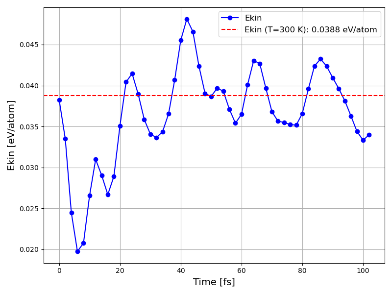

Tutorial: Fullerene Molecular Dynamics (Quantum ESPRESSO)
=========================================================

This tutorial explains how to perform an NVT molecular dynamics simulation
of fullerene (C60-based) systems using ASE (Atomic Simulation Environment)
and Quantum ESPRESSO.

Sample files are located in ``sample/fullerene_qe_md/``.

Prerequisites
-------------

- Quantum ESPRESSO (pw.x) is installed
- ASE is installed
- Pseudopotential file for C (``C.pbe-n-kjpaw_psl.1.0.0.UPF``)
- Crystal structure file (``C.cif``)

File Structure
--------------

.. code-block:: text

   sample/fullerene_qe_md/
   ├── do.sh                 # Execution script (for local runs)
   ├── job_ohtaka.sh         # Job script for the ISSP Ohtaka cluster
   ├── ase_qe.py             # MD simulation script
   └── time_energy_plot.py   # Results visualization script

Simulation Settings
-------------------

Key settings in ``ase_qe.py``:

Reading the Structure and Creating a Supercell
~~~~~~~~~~~~~~~~~~~~~~~~~~~~~~~~~~~~~~~~~~~~~~~

.. code-block:: python

   from ase.io import read
   from ase.build import make_supercell

   atoms = read("C.cif")
   atoms.pbc = [1, 1, 1]
   supercell_matrix = [[2, 0, 0], [0, 1, 0], [0, 0, 1]]
   supercell = make_supercell(atoms, supercell_matrix)

The structure is read from a CIF file and a supercell doubled in the x-direction (480 atoms) is created.

Quantum ESPRESSO Settings
~~~~~~~~~~~~~~~~~~~~~~~~~

.. code-block:: python

   input_data = {
       'control': {
           'calculation': 'scf',
           'pseudo_dir': './',
           'outdir': './'
       },
       'system': {
           'ecutwfc': 40,    # Wavefunction cutoff [Ry]
           'ecutrho': 160,   # Charge density cutoff [Ry]
           'occupations': 'smearing',
           'smearing': 'gaussian',
           'degauss': 0.02,
       },
       'electrons': {
           'conv_thr': 1e-7
       }
   }

.. list-table::
   :header-rows: 1
   :widths: 25 75

   * - Parameter
     - Description
   * - ``ecutwfc``
     - Wavefunction cutoff energy (40 Ry)
   * - ``ecutrho``
     - Charge density cutoff energy (160 Ry)
   * - ``smearing``
     - Gaussian smearing (degauss = 0.02 Ry)
   * - ``conv_thr``
     - SCF convergence threshold (10\ :sup:`-7` Ry)

MD Settings
~~~~~~~~~~~

.. code-block:: python

   from ase import units
   from ase.md.velocitydistribution import MaxwellBoltzmannDistribution
   from ase.md.nvtberendsen import NVTBerendsen

   dt = 2 * units.fs          # Time step: 2 fs
   temperature_K = 300        # Target temperature: 300 K
   nsteps = 100               # Number of steps: 100

   MaxwellBoltzmannDistribution(supercell, temperature_K=300)

   taut = 0.5 * 10 * units.fs  # Temperature coupling time constant: 5 fs
   dyn = NVTBerendsen(supercell, timestep=dt, temperature=temperature_K,
                      taut=taut, logfile='md.log')
   dyn.run(nsteps)

- **Ensemble**: NVT (Berendsen thermostat)
- **Initial velocities**: Maxwell-Boltzmann distribution (300 K)
- **Time step**: 2 fs
- **Total simulation time**: 200 fs (100 steps x 2 fs)

How to Run
----------

Local execution:

.. code-block:: bash

   cd sample/fullerene_qe_md
   sh do.sh

To run on the ISSP Ohtaka cluster:

.. code-block:: bash

   sbatch job_ohtaka.sh

``job_ohtaka.sh`` is a SLURM job script that includes the partition settings,
number of nodes, QE module loading, etc. Edit it according to your environment.

Output files:

- ``md.log``: Time, energy, kinetic energy, and temperature at each step
- ``benzene_optimization.traj``: ASE trajectory file
- ``espresso.pwi`` / ``espresso.pwo``: QE input/output files

Visualization of Results
------------------------

Use ``time_energy_plot.py`` to plot the time evolution of kinetic energy:

.. code-block:: bash

   python3 time_energy_plot.py

   Time evolution of kinetic energy (eV/atom) of the fullerene supercell.
   The red dashed line indicates the theoretical value at 300 K: :math:`E_{kin} = \frac{3}{2} k_B T` = 0.0388 eV/atom.

Calculation Results
~~~~~~~~~~~~~~~~~~~

Output format of md.log:

.. code-block:: text

   Time[ps]      Etot[eV]     Epot[eV]     Ekin[eV]    T[K]
   0.0000         -XXX.XX      -XXX.XX       XX.XX     300.0
   0.0020         -XXX.XX      -XXX.XX       XX.XX     2XX.X
   ...

- At the beginning of the simulation, the temperature fluctuates and converges around 300 K
- The Berendsen thermostat relaxes the system toward the target temperature
- Thermal equilibrium is reached after a sufficient number of steps

Generating Training Data
------------------------

To generate training data for AENET from the MD trajectory,
the trajectory can be converted to XSF format following the same procedure
as ``teach_data_make.py`` described in :doc:`tutorial_fullerene_elses`.
