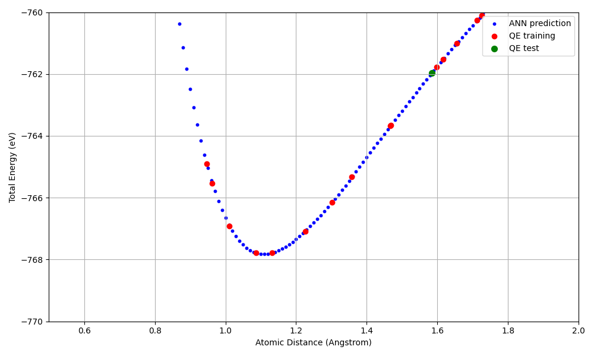

Tutorial: AENET Training Pipeline
======================================

In this tutorial, we use the N2 dimer as an example to explain the complete procedure
for creating training data from first-principles calculations (Quantum ESPRESSO)
and building a machine learning potential with AENET.

The sample files are located in ``sample/aenet_training/``.

Workflow Overview
------------------

.. code-block:: text

   1. Structure Generation (relax/)
      └→ Generate random N2 dimer structures
      └→ Compute energies and forces with QE (SCF)

   2. Training Data Creation (relax/)
      └→ Extract energies and forces from QE output
      └→ Generate training data in XSF format

   3. Fingerprint Generation (generate/)
      └→ Compute atomic descriptors with AENET generate.x

   4. Neural Network Training (train/)
      └→ Train the potential with AENET train.x

   5. Prediction and Validation (predict/)
      └→ Predict energies of test structures with AENET predict.x
      └→ Compare with QE calculations

Step 1: Structure Generation
-----------------------------

Work in the ``sample/aenet_training/relax/`` directory.

``structure_make.py`` randomly generates N-N bond distances in the range of 0.5 to 2.0 Angstrom
and creates Quantum ESPRESSO input files.

.. note::

   A pseudopotential file (``N.pbe-n-kjpaw_psl.1.0.0.UPF``) is required in each directory.
   When using ``run_all.sh``, it is downloaded automatically.
   For manual execution, place it in the ``relax/pseudo_Potential/`` directory.

.. code-block:: python

   import random
   structure_list = []
   for i in range(20):
       structure_list.append(random.uniform(0.5, 2.0))

The template file (``template.txt``) is in QE input format, where ``value_01`` is
the placeholder for the N-N bond distance:

.. code-block:: text

   &CONTROL
     calculation = 'scf'
     tprnfor     = .true.
     pseudo_dir  = './'
     outdir      = './'
   /
   &SYSTEM
     ntyp = 1, nat = 2, ibrav = 0
     ecutwfc = 44, ecutrho = 320
     occupations = 'smearing'
     smearing    = 'mp'
     degauss     = 0.01
   /
   ...
   ATOMIC_POSITIONS angstrom
     N 0.00 0.00 0.00
     N 0.00 0.00 value_01

.. note::

   - ``calculation='scf'`` performs a single-point calculation (no structural relaxation)
     at each geometry. This is used to obtain energies and forces at various
     randomly generated N-N distances.
   - ``tprnfor=.true.`` enables printing of forces acting on atoms.
     Both energy and forces are required for AENET training data (XSF files),
     so this option must be specified.

Execution:

.. code-block:: bash

   python3 structure_make.py

This generates ``directory_0/`` through ``directory_19/``, each containing a QE input file.

Run QE in each directory:

.. code-block:: bash

   pw.x < n2_dimer.pwi > n2_dimer.pwo

Step 2: Training Data Creation
-------------------------------

Extract energies and interatomic forces from the QE output files and convert them to AENET's XSF format.

``teach_data_make.py`` uses ASE's ``ase.io.read()`` to read QE output files and
extracts energies (eV), atomic coordinates (Angstrom), and forces (eV/Angstrom),
outputting them in XSF format.

.. code-block:: bash

   cd directory_0
   python3 ../teach_data_make.py --input n2_dimer.pwo --output-dir teach_data

Output example (teach_data_1.xsf):

.. code-block:: text

   # total energy = -767.51 eV

   ATOMS
   N   0.00000000   0.00000000   0.00000000   0.00000000   0.00000000  -12.34567890
   N   0.00000000   0.00000000   1.04970000   0.00000000   0.00000000   12.34567890

Step 3: Fingerprint Generation
-------------------------------

Work in the ``sample/aenet_training/generate/`` directory.

In ``generate.in``, specify the paths to the training data and the atomic species:

.. code-block:: text

   OUTPUT N2.train

   TYPES
   1
   N 389.83

   SETUPS
   N N.fingerprint.stp

   FILES
   20
   ../relax/directory_0/teach_data/teach_data_1.xsf
   ../relax/directory_1/teach_data/teach_data_1.xsf
   ...

Description of each keyword:

- **OUTPUT**: Output file name. Binary file storing the fingerprint data (here, ``N2.train``)
- **TYPES**: Number of atomic species (next line) and, for each species, the element symbol and atomic energy shift value in eV (``N 389.83``)
- **SETUPS**: Fingerprint setup file for each atomic species (``N.fingerprint.stp``)
- **FILES**: Number of training data XSF files (next line) and the path to each file

``N.fingerprint.stp`` is a fingerprint (structural descriptor) configuration file
that defines how the local atomic environment is transformed into input for the neural network.
It is required as input to ``generate.x``.
For details on the file format, see the
`AENET official documentation <https://github.com/atomisticnet/aenet/blob/master/doc/input-files/fingerprint-setup.org>`_.

Example configuration for an N2 dimer:

.. code-block:: text

   DESCR
     Structural fingerprint setup for N-N in linear nitrogen molecule
   END DESCR

   ATOM N

   ENV  1
   N

   RMIN 0.5

   SYMMFUNC type=Behler2011
   9
   G=2 type2=N   eta=0.001  Rs=0.0  Rc=3.0
   G=2 type2=N   eta=0.01   Rs=0.0  Rc=3.0
   G=2 type2=N   eta=0.1    Rs=0.0  Rc=3.0
   G=4 type2=N  type3=N   eta=0.001 lambda=-1.0  zeta=4.0 Rc=3.0
   G=4 type2=N  type3=N   eta=0.001 lambda=1.0   zeta=4.0 Rc=3.0
   G=4 type2=N  type3=N   eta=0.01  lambda=-1.0  zeta=4.0 Rc=3.0
   G=4 type2=N  type3=N   eta=0.01  lambda=1.0   zeta=4.0 Rc=3.0
   G=4 type2=N  type3=N   eta=0.1   lambda=-1.0  zeta=4.0 Rc=3.0
   G=4 type2=N  type3=N   eta=0.1   lambda=1.0   zeta=4.0 Rc=3.0

Description of each keyword:

- **ATOM**: The central atom element for which fingerprints are computed (here, N)
- **ENV**: Number of species in the environment and their symbols. N2 is a single-species system, so 1 (N only)
- **RMIN**: Minimum interatomic distance (Angstrom). Structures with shorter distances are excluded
- **SYMMFUNC type=Behler2011**: Uses Behler's symmetry functions [J. Behler, J. Chem. Phys. 134, 074106 (2011)]

  - **G=2** (radial functions): Descriptors depending on two-body distances

    - ``eta``: Width of the function. Smaller values give sharper functions, larger values give smoother ones
    - ``Rs``: Shift of the function center
    - ``Rc``: Cutoff distance (Angstrom). Only atoms within this range are considered

  - **G=4** (angular functions): Descriptors depending on three-body angles

    - ``eta``: Radial width
    - ``lambda``: +1 or -1. Controls the sign of the angular dependence
    - ``zeta``: Angular resolution. Larger values increase sensitivity to specific angles
    - ``Rc``: Cutoff distance (Angstrom)

Execution:

.. code-block:: bash

   generate.x generate.in > generate.out

Output:

- ``N2.train``: Binary dataset for training

Step 4: Neural Network Training
---------------------------------

Work in the ``sample/aenet_training/train/`` directory.

Set the training parameters in ``train.in``:

.. code-block:: text

   TRAININGSET N2.train
   TESTPERCENT 10
   ITERATIONS  3000

   TIMING

   bfgs

   NETWORKS
   # atom   network           hidden
   # types  file-name         layers   nodes:activation
   N        N.5t-5t.ann       2        10:tanh 10:tanh

Description of each keyword:

- **TRAININGSET**: Fingerprint data file generated by ``generate.x`` (here, ``N2.train``)
- **TESTPERCENT**: Percentage of training data used for testing (here, 10%)
- **ITERATIONS**: Number of weight optimization iterations (here, 3000)
- **TIMING**: Print execution time for each iteration
- **bfgs**: Weight optimization method. Choose from:

  - ``steepest_descent``: Online steepest descent
  - ``bfgs``: BFGS quasi-Newton method (recommended)
  - ``levenberg_marquardt``: Levenberg-Marquardt method

- **NETWORKS**: Neural network configuration. Each line specifies:

  - Element symbol of the atomic species (``N``)
  - Output ANN potential file name (``N.5t-5t.ann``)
  - Number of hidden layers (``2``)
  - Nodes and activation function for each hidden layer (``10:tanh 10:tanh``)

Execution:

.. code-block:: bash

   train.x train.in > train.out

Example of training results (from train.out):

.. code-block:: text

   Number of training structures :         18
   Number of testing structures  :          2
   Total number of weights       :        221
   Atomic energy shift           :   -747.530391 eV

Output:

- ``N.5t-5t.ann``: Trained ANN potential file

Step 5: Prediction and Validation
-----------------------------------

Work in the ``sample/aenet_training/predict/`` directory.

First, generate the test XSF files using ``generate_test_xsf.py``.
This creates 201 structures with N-N distances from 0.00 to 2.00 Angstrom in 0.01 Angstrom increments:

.. code-block:: bash

   python3 generate_test_xsf.py

This generates test XSF files in the ``predict_data_set_test/`` directory.

Then, configure the prediction settings in ``predict.in``:

.. code-block:: text

   TYPES
   1
   N

   NETWORKS
     N  N.5t-5t.ann

   FORCES

   FILES
   201
   ../predict_data_set_test/test_0.00.xsf
   ../predict_data_set_test/test_0.01.xsf
   ...

Description of each keyword:

- **TYPES**: Number of atomic species (next line) and the element symbol for each species
- **NETWORKS**: Trained ANN potential file for each atomic species (``N.5t-5t.ann``)
- **FORCES**: Also predict forces (optional)
- **FILES**: Number of XSF files to predict (next line) and the path to each file

Predict energies using the trained potential:

.. code-block:: bash

   predict.x predict.in > predict.out

Visualization of Results
~~~~~~~~~~~~~~~~~~~~~~~~~

Use ``plot_distance_energy.py`` to create a plot comparing the predicted energies from the ANN potential
with the first-principles calculation results from QE:

.. code-block:: bash

   python3 plot_distance_energy.py \
       --predict-out predict.out \
       --train-out ../train/train.out \
       --qe-dir ../relax \
       --n-structures 20 \
       --output distance_energy_plot.png

This script plots the following three datasets:

- **ANN prediction** (blue): Interatomic distance vs. energy from ``predict.out``
- **QE training data** (red): Results from the SCF calculation XSF files
- **QE test data** (green): Data points included in the test set from ``train.out``

In addition to the full-range plot (``distance_energy_plot.png``), a zoomed-in plot
around the potential minimum (``distance_energy_plot_zoom.png``, y-axis: -770 to -760 eV)
is also generated automatically.

Calculation Results
~~~~~~~~~~~~~~~~~~~~

The following graph compares the predicted energies from the ANN potential
with the first-principles calculation results from QE (zoomed in around the potential minimum).

   Energy-distance curve for the N2 dimer (zoomed in). Blue: ANN prediction, Red: QE training data, Green: QE test data.

Key results:

- A Morse-type potential curve is reproduced, with the energy minimum (approximately -768 eV) near the equilibrium N-N distance (approximately 1.1 Angstrom)
- The ANN potential reproduces the QE results well within the range of the training data (20 points)
