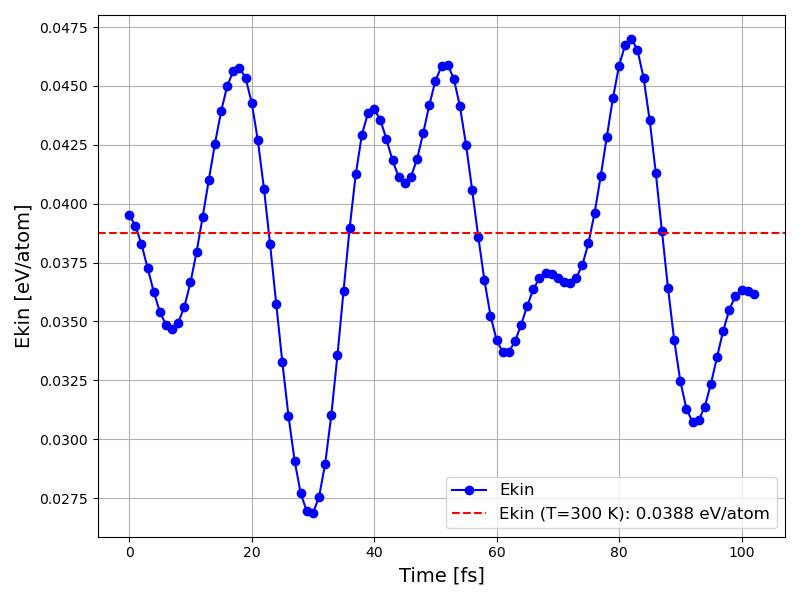

チュートリアル: フラーレン分子動力学（ELSES）
==============================================

本チュートリアルでは、ASE (Atomic Simulation Environment) と
ELSES 電子状態計算コードを用いて、フラーレン（C480）の NVT 分子動力学シミュレーションを
実行し、そのトラジェクトリから AENET の教師データを生成する方法を説明します。

サンプルファイルは ``sample/fullerene_elses_md/`` にあります。

前提条件
--------

- ELSES がインストール済みであること（``elses``, ``elses-xml-generate``）
- ASE がインストール済みであること
- 本パッケージの ElsesCalculator がインストール済みであること
- 結晶構造ファイル（``C.cif``）

ファイル構成
------------

.. code-block:: text

   sample/fullerene_elses_md/
   ├── do.sh                 # 実行スクリプト
   ├── test_elses.py         # MD シミュレーションスクリプト
   ├── teach_data_make.py    # 教師データ生成スクリプト
   ├── time_energy_plot.py   # 結果可視化スクリプト
   └── animation.py          # MD トラジェクトリのアニメーション生成

シミュレーション設定
--------------------

``test_elses.py`` の主要な設定項目:

ELSES Calculator の設定
~~~~~~~~~~~~~~~~~~~~~~~~

.. code-block:: python

   from ElsesCalculator import elses

   command = 'elses-xml-generate generate.xml C480.xml ; srun elses config.xml > log.txt'
   calc = elses(command=command)
   supercell.calc = calc

``command`` に ELSES の実行コマンドを指定します。ELSES は以下の 2 段階で実行されます:

1. ``elses-xml-generate``: 入力 XML の生成
2. ``elses``: 電子状態計算の実行

構造の準備
~~~~~~~~~~

.. code-block:: python

   from ase.io import read
   from ase.build import make_supercell

   atoms = read("C.cif")
   atoms.pbc = [1, 1, 1]
   supercell_matrix = [[2, 0, 0], [0, 1, 0], [0, 0, 1]]
   supercell = make_supercell(atoms, supercell_matrix)

CIF ファイルから C240 構造を読み込み、x 方向に 2 倍した C480 スーパーセルを作成します。

MD 設定
~~~~~~~

.. code-block:: python

   from ase import units
   from ase.md.nvtberendsen import NVTBerendsen
   from ase.md.velocitydistribution import MaxwellBoltzmannDistribution

   dt = 1.0 * units.fs        # タイムステップ: 1 fs
   temperature_K = 300        # 目標温度: 300 K
   nsteps = 100               # ステップ数: 100

   MaxwellBoltzmannDistribution(supercell, temperature_K=300)

   taut = 0.5 * 10 * units.fs
   dyn = NVTBerendsen(supercell, timestep=dt, temperature=temperature_K,
                      taut=taut, trajectory=traj, logfile='md.log')
   dyn.run(nsteps)

- **アンサンブル**: NVT（Berendsen サーモスタット）
- **タイムステップ**: 1 fs（QE 版より短い: ELSES の安定性のため）
- **総シミュレーション時間**: 100 fs

実行方法
--------

.. code-block:: bash

   cd sample/fullerene_elses_md
   sh do.sh

出力ファイル:

- ``md.log``: 各ステップの時間、エネルギー、運動エネルギー、温度
- ``benzene_optimization.traj``: ASE トラジェクトリファイル

結果の可視化
------------

.. code-block:: bash

   python3 time_energy_plot.py

   ELSES によるフラーレンスーパーセルの運動エネルギー（eV/atom）の時間変化。
   赤破線は 300 K における理論値。

教師データの生成
----------------

MD トラジェクトリから AENET の教師データ（XSF 形式）を生成します。

.. code-block:: bash

   python3 teach_data_make.py

``teach_data_make.py`` は以下を行います:

1. ``.traj`` ファイルから各フレームの構造を読み込み
2. エネルギー、原子座標、力を抽出
3. XSF 形式で ``teach_data/`` ディレクトリに出力

.. code-block:: python

   from ase.io import Trajectory

   structures = Trajectory('benzene_optimization.traj')
   for i, atoms in enumerate(structures):
       total_energy = atoms.get_total_energy()
       positions = atoms.get_positions()
       forces = atoms.get_forces()
       # XSF 形式で出力

出力される XSF ファイルの形式:

.. code-block:: text

   # total energy = -XXXX.XX eV

   CRYSTAL
   PRIMVEC
     XX.XXXXXXXX  0.00000000  0.00000000
     0.00000000  XX.XXXXXXXX  0.00000000
     0.00000000  0.00000000  XX.XXXXXXXX
   PRIMCOORD
   480 1
   C  x.xxxxxxxx  y.yyyyyyyy  z.zzzzzzzz  fx.xxxxxxxx  fy.yyyyyyyy  fz.zzzzzzzz
   ...

- 周期的境界条件の場合は ``CRYSTAL`` + ``PRIMVEC`` + ``PRIMCOORD`` 形式
- 孤立系の場合は ``ATOMS`` 形式
- 各行: 元素記号、x, y, z 座標、fx, fy, fz 力

生成された教師データは、:doc:`tutorial_training` の手順で AENET のポテンシャル構築に利用できます。

トラジェクトリのアニメーション
------------------------------

``animation.py`` を使用して、MD トラジェクトリを可視化するアニメーション GIF を作成できます。

.. code-block:: bash

   python3 animation.py --traj benzene_optimization.traj --output animation.gif \
       --natoms 480 --dt 10.0 --nframes 10

出力される GIF は、構造の変化と運動エネルギーの時間変化を並べて表示します。

.. note::

   アニメーション生成には ``imagemagick`` が必要です。
   macOS の場合: ``brew install imagemagick``

QE との比較
-----------

ELSES と Quantum ESPRESSO による MD シミュレーションの比較:

.. list-table::
   :header-rows: 1
   :widths: 25 35 40

   * - 項目
     - QE (:doc:`tutorial_fullerene_qe`)
     - ELSES (本チュートリアル)
   * - 計算手法
     - DFT (PAW)
     - 密結合法ベース
   * - タイムステップ
     - 2 fs
     - 1 fs
   * - 計算コスト
     - 高（64 コア並列が必要）
     - 中
   * - 精度
     - 第一原理精度
     - 近似的
   * - 用途
     - 高精度教師データ生成
     - 大規模系・長時間 MD
