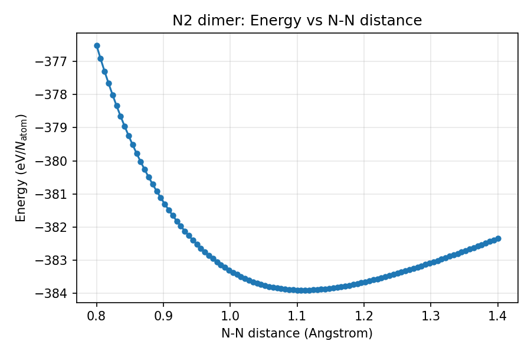

チュートリアル: AENET + mapper によるグリッド探索
=====================================================

本チュートリアルでは、AENET で構築した機械学習ポテンシャルと ODAT-SE の
mapper（グリッド探索）を組み合わせて、
N2 二量体のエネルギー曲面を網羅的に評価する方法を説明します。

サンプルファイルは ``sample/aenet_mapper/`` にあります。

前提条件
--------

- AENET の ``predict.x`` がインストール済みであること
- 学習済みの ANN ポテンシャルファイル（``N.5t-5t.ann``）が準備済みであること
  （:doc:`tutorial_training` を参照）

ファイル構成
------------

.. code-block:: text

   sample/aenet_mapper/
   ├── input.toml             # ODAT-SE 設定ファイル
   ├── predict.in             # AENET 予測設定
   ├── template.xsf           # 構造テンプレート
   ├── run_all.sh             # 実行スクリプト
   └── plot_colormap.py       # 距離-エネルギー曲線のプロット

input.toml の説明
------------------

.. code-block:: toml

   [base]
   dimension = 1
   output_dir = "output"

パラメータ空間の次元を 1（N-N 結合距離のみ）に設定します。

.. code-block:: toml

   [solver]
   name = "aenet"

   [solver.config]
   aenet_exec_file = "predict.x"
   aenet_ann_potential = "N.5t-5t.ann"

   [solver.param]
   string_list = ["value_01"]

ソルバーとして AENET を使用し、``predict.x`` のパスと ANN ポテンシャルファイルを指定します。
``string_list`` はテンプレート内のプレースホルダーです。

.. code-block:: toml

   [algorithm]
   name = "mapper"
   label_list = ["z"]

   [algorithm.param]
   min_list = [0.8]
   max_list = [1.4]
   num_list = [101]

mapper アルゴリズムの設定:

.. list-table::
   :header-rows: 1
   :widths: 30 70

   * - パラメータ
     - 説明
   * - ``min_list`` / ``max_list``
     - 探索範囲: N-N 距離 0.8〜1.4 Å
   * - ``num_list``
     - グリッド点数: 101（等間隔に分割、刻み幅 0.006 Å）

テンプレートファイル
--------------------

``template.xsf`` は N2 二量体の構造テンプレートです:

.. code-block:: text

   ATOMS
   N             0.0000000000        0.0000000000        0.0000000000
   N             0.0000000000        0.0000000000        value_01

``value_01`` が mapper によって 0.8〜1.4 Å の範囲で等間隔に評価される N-N 結合距離です。

実行方法
--------

一括実行スクリプト:

.. code-block:: bash

   cd sample/aenet_mapper
   sh run_all.sh

または直接実行:

.. code-block:: bash

   odatse-aenet input.toml

101 点のグリッド探索はシリアル実行で約 1 秒で完了します。

出力
----

計算結果は ``output/`` ディレクトリに生成されます:

- ``output/ColorMap.txt``: 各グリッド点における N-N 距離とエネルギーの対応表

``ColorMap.txt`` のフォーマット:

.. code-block:: text

   # z  fx
   0.800000  <energy>
   0.806000  <energy>
   ...

1列目が N-N 距離（Å）、2列目がエネルギー（eV/atom）です。

結果の可視化
~~~~~~~~~~~~

``plot_colormap.py`` を使って距離-エネルギー曲線をプロットできます:

.. code-block:: bash

   python3 plot_colormap.py

``distance_energy.png`` が生成されます。

計算結果
--------

グリッド探索の結果、エネルギーが最小となる N-N 結合距離が約 1.1 Å であることがわかります。

   N2 二量体の距離-エネルギー曲線（mapper によるグリッド探索の結果）

エネルギー最小のグリッド点を確認します:

.. code-block:: bash

   sort -k2 -n output/ColorMap.txt | head -5

.. code-block:: text

   1.106000 -383.911050
   1.112000 -383.910955
   1.100000 -383.908373
   1.118000 -383.908224
   1.124000 -383.902987

エネルギー最小点は z = 1.106 Å です。
