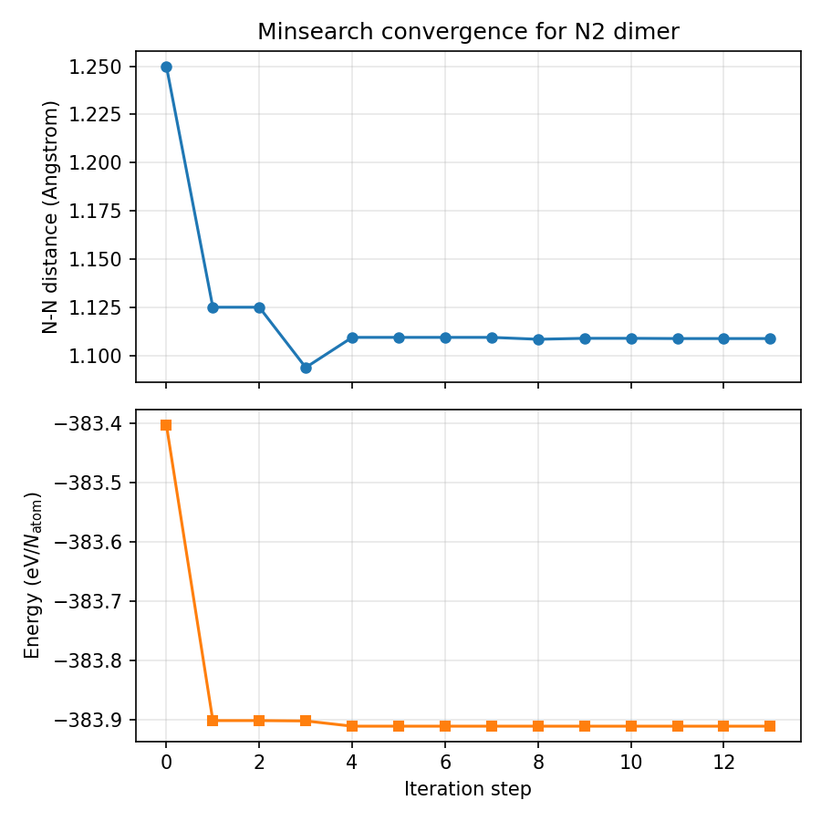

チュートリアル: AENET + minsearch による最小化
=====================================================

本チュートリアルでは、AENET で構築した機械学習ポテンシャルと ODAT-SE の
minsearch（Nelder-Mead 法）を組み合わせて、
N2 二量体の最適な N-N 結合距離を求める方法を説明します。

サンプルファイルは ``sample/aenet_minsearch/`` にあります。

前提条件
--------

- AENET の ``predict.x`` がインストール済みであること
- 学習済みの ANN ポテンシャルファイル（``N.5t-5t.ann``）が準備済みであること
  （:doc:`tutorial_training` を参照）

ファイル構成
------------

.. code-block:: text

   sample/aenet_minsearch/
   ├── input.toml             # ODAT-SE 設定ファイル
   ├── predict.in             # AENET 予測設定
   ├── template.xsf           # 構造テンプレート
   └── run_all.sh             # 実行スクリプト

input.toml の説明
------------------

.. code-block:: toml

   [base]
   dimension = 1
   output_dir = "output"

パラメータ空間の次元を 1（N-N 結合距離のみ）に設定します。

.. code-block:: toml

   [solver]
   name = "aenet"

   [solver.config]
   aenet_exec_file = "predict.x"
   aenet_ann_potential = "N.5t-5t.ann"

   [solver.param]
   string_list = ["value_01"]

ソルバーとして AENET を使用し、``predict.x`` のパスと ANN ポテンシャルファイルを指定します。
``string_list`` はテンプレート内のプレースホルダーです。

.. code-block:: toml

   [algorithm]
   name = "minsearch"
   label_list = ["z"]

   [algorithm.param]
   min_list = [0.5]
   max_list = [2.0]
   initial_list = [1.25]

   [algorithm.minimize]
   initial_scale_list = [0.25]
   xatol = 0.0001
   fatol = 0.0001
   maxiter = 100

minsearch アルゴリズムの設定:

.. list-table::
   :header-rows: 1
   :widths: 30 70

   * - パラメータ
     - 説明
   * - ``min_list`` / ``max_list``
     - 探索範囲: N-N 距離 0.5〜2.0 Å
   * - ``initial_list``
     - 初期値: 1.25 Å
   * - ``initial_scale_list``
     - 初期シンプレックスのスケール: 0.25 Å
   * - ``xatol``
     - パラメータの収束判定閾値: 0.0001 Å
   * - ``fatol``
     - 関数値の収束判定閾値: 0.0001 eV/atom
   * - ``maxiter``
     - 最大反復回数: 100

テンプレートファイル
--------------------

``template.xsf`` は N2 二量体の構造テンプレートです:

.. code-block:: text

   ATOMS
   N             0.0000000000        0.0000000000        0.0000000000
   N             0.0000000000        0.0000000000        value_01

``value_01`` が minsearch によって最適化される N-N 結合距離です。

実行方法
--------

一括実行スクリプト:

.. code-block:: bash

   cd sample/aenet_minsearch
   sh run_all.sh

または直接実行:

.. code-block:: bash

   odatse-aenet input.toml

Nelder-Mead 法による最適化は 13 反復（26 回の関数評価）で収束し、約 1 秒で完了します。

出力
----

計算結果は ``output/`` ディレクトリに生成されます:

- ``output/res.txt``: 最適化結果（最適パラメータと目的関数値）
- ``output/SimplexData.txt``: Nelder-Mead 法のシンプレックスの反復履歴

``res.txt`` には、最適化された N-N 結合距離とそのときのエネルギー（eV/atom）が記録されます。

``SimplexData.txt`` のフォーマット:

.. code-block:: text

   # step  z  fx

各行がシンプレックスの各ステップにおけるパラメータ値と関数値です。

計算結果
--------

Nelder-Mead 法による最適化の結果、最適な N-N 結合距離として約 1.1 Å が得られます。

   Nelder-Mead 法による N-N 結合距離の収束過程。上段: N-N 距離、下段: エネルギー（eV/atom）。

最適化結果の確認:

.. code-block:: bash

   cat output/res.txt
